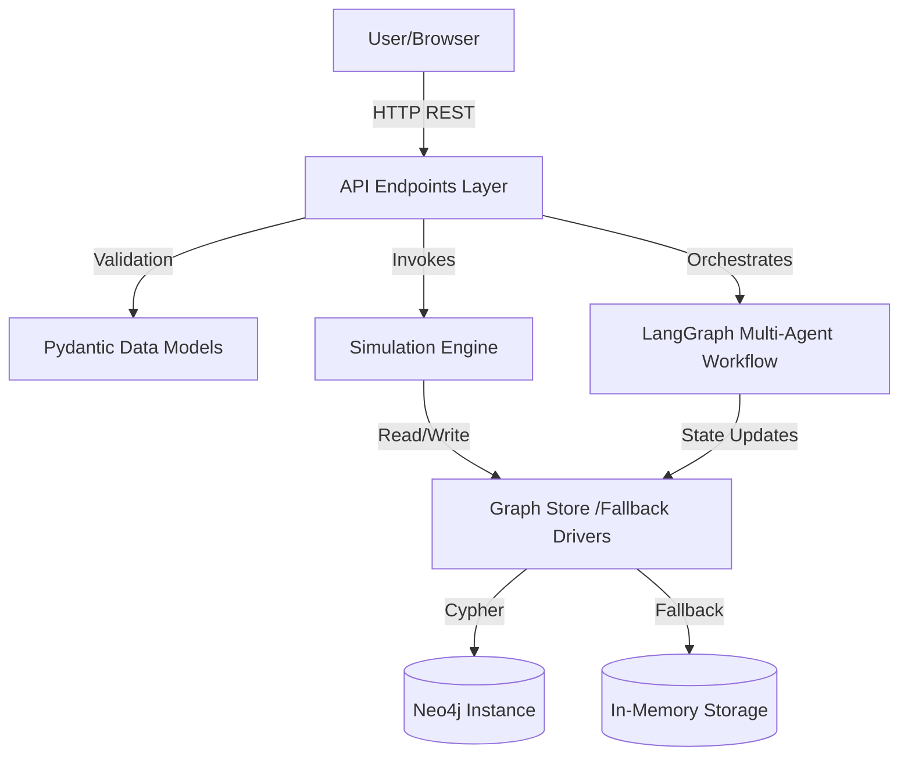

# EMIOS Engineering Assessment Report

This report provides a comprehensive architectural and code quality evaluation of the Enterprise Migration Intelligence Operating System (EMIOS), reviewing its readiness for production deployment and long-term maintenance.

---

## 1. Repository Overview

EMIOS is structured as a modular mono-repository consisting of:
* **Backend Layer (`backend/`)**: Built on FastAPI, incorporating static typing (Pydantic), mathematical forecasting engines, and a state-based multi-agent coordination workflow managed by LangGraph.
* **Frontend Layer (`frontend/`)**: A Single Page Application (SPA) driven by React, Vis.js for vector graph rendering, and Recharts for confidence curve visualizations.
* **Orchestration Layer**: Docker Compose profiles establishing connections to Neo4j (graph store) and Qdrant (vector index).

---

## 2. Architecture Summary

EMIOS employs a **layered, service-oriented architecture**:



* **Ingestion decoupling**: The UI uploads raw formats (CSV sheets or JSON dumps) as file Blobs. The backend resolver automatically normalizes them into memory schemas.
* **Resilient Dual-Mode Drivers**: Database interaction is abstract. The engine boots in **Zero-Configuration Fallback Mode** (pure-python in-memory graph) if Neo4j is offline, or switches to **Complete Database Mode** if active drivers are found.

---

## 3. Module-wise Responsibilities

| Module Pathway | Responsibility |
| :--- | :--- |
| **[main.py](file:///e:/POC_Projects/EMIOS/backend/main.py)** | App bootstrap, CORSMiddleware, latency metric logging, exception handler bindings, and static assets mounting. |
| **[api/endpoints.py](file:///e:/POC_Projects/EMIOS/backend/app/api/endpoints.py)** | REST controllers parsing files, delegating calculations, and wrapping `/api/health` status. |
| **[services/simulation_engine.py](file:///e:/POC_Projects/EMIOS/backend/app/services/simulation_engine.py)** | Numerical calculations including Breadth-First search risk pathfinders and Mode-Triangular Monte Carlo simulations. |
| **[agents/workflow.py](file:///e:/POC_Projects/EMIOS/backend/app/agents/workflow.py)** | LangGraph agents state transitions, rules evaluations, and wave plan generation. |
| **[core/constants.py](file:///e:/POC_Projects/EMIOS/backend/app/core/constants.py)** | Calculations coefficients registries (attenuations, complexity timings, scheduling penalties). |
| **[core/config.py](file:///e:/POC_Projects/EMIOS/backend/app/core/config.py)** | Pydantic Settings parsing environmental configurations (.env). |
| **[core/exceptions.py](file:///e:/POC_Projects/EMIOS/backend/app/core/exceptions.py)** | Dedicated custom platform exceptions mapping to HTTP status content. |
| **[core/logging_config.py](file:///e:/POC_Projects/EMIOS/backend/app/core/logging_config.py)** | Structured log formatters. |

---

## 4. Dependency Analysis

### Python Dependencies
* **Core Framework**: `fastapi` and `uvicorn` (ASGI lifecycle and routing).
* **Graph Logic**: `networkx` (transitive closure pathfinding and loops detection).
* **Agentic Workflows**: `langgraph` (state machine coordination).
* **Validation**: `pydantic` and `pydantic-settings` (type safety).
* **Testing**: `pytest` and `httpx` (E2E API test assertions).
* **Fallback Compliance**: Pure-python focus ensures no compiled Rust/C modules are required, making it highly portable.

### Frontend Dependencies
* **React 18 & Babel**: Loaded via UMD/CDNs for zero-build quick starts.
* **Vis-Network**: Renders physics-based network layouts.
* **Recharts**: Plots the S-curve duration and cost probability curves.

---

## 5. Production Readiness Score (88 / 100)

We evaluate EMIOS at a **Readiness Score of 88/100**:

* **Strengths (+88)**:
  * Centralized configuration (.env bindings).
  * Structured logger and HTTP process latency headers.
  * Specialized domain exception handlers and responses.
  * Pytest coverage mapping routes and algorithms logic.
  * Multi-stage production container profiles (Dockerfile).
  * Observation health check hooks.
* **Residual Gaps (-12)**:
  * Loose coupling violation in `neo4j_service.py` (concrete driver references are direct; lacks abstract GraphRepository interface).
  * Direct inline UMD CDN loads in frontend (Vite/webpack bundling would improve asset caching in enterprise networks).

---

## 6. Technical Debt & Risks

### Technical Debt
* **TD-04**: Direct database client references inside services. 
  * *Refactoring Recommendation*: Abstract graph methods into a `GraphRepository` base interface, completely isolating driver implementations.
* **TD-05**: Frontend UMD CDN dependencies could cause startup failures if internet access is restricted in local staging networks.

### Environmental Risks
* **Python 3.14 Compatibility**: The staging environment runs Python 3.14 (experimental/pre-release). Compiled packages like NumPy fail to build due to missing binary wheels.
  * *Mitigation*: The project is strictly built on pure-python libraries (`networkx` + standard library math), ensuring zero-compilation compatibility.

---

## 7. Quick Wins & Refactoring Areas

1. **Vite/Webpack Bundling (Frontend)**: Bundle `index.html` assets to remove external CDN dependencies, securing offline staging environment load paths.
2. **Interface Segregation**: Extract database operations from [neo4j_service.py](file:///e:/POC_Projects/EMIOS/backend/app/services/neo4j_service.py) into a clean Repository Pattern interface.

---

## Appendix: Ingestion Data Formats & Inputs

EMIOS supports two standard input layouts for mapping system topologies without data cleansing:

### Input Format A: Spreadsheet Mapping (CSV)
This layout separates node profiles and edge links across two standard CSV tables (which can be pasted into the UI upload forms):
1. **Nodes Table (`metadata.csv`)**:
   ```csv
   System ID,System Name,Category,Priority,Monthly Revenue ($),Complexity,Migration Cost ($),Migration Time (Days)
   monolith,Legacy Core Monolith,Monolith,High,120000.0,High,250000.0,90
   auth_db,Authentication Database,Database,High,80000.0,Medium,45000.0,20
   ```
2. **Edges Table (`dependencies.csv`)**:
   ```csv
   From System,To System,Connection Type,Importance
   monolith,auth_db,DB,High
   ```

### Input Format B: Infrastructure Component Mapping (JSON)
EMIOS also dynamically parses component-level system configurations directly from a single raw JSON array (matching standard cloud inventory exports):
```json
[
  {
    "component_id": "PaymentService",
    "runtime": "Java 17",
    "downstream_dependencies": ["AuthService", "UserDB"],
    "business_criticality": "High",
    "annual_hosting_cost": 45000
  }
]
```
* **Parser Resolution**: The FastAPI backend parses the array directly:
  * Creates nodes with specific **Runtime** (`Java 17`) and **Annual Hosting Cost** (`$45,000/yr`) attributes.
  * Deduces system types and establishes dependency linkages from the `downstream_dependencies` list.
  * Propagates annual hosting costs to calculate total potential savings (Est. 30% reduction post-modernization) for Value Quantification dashboards.
