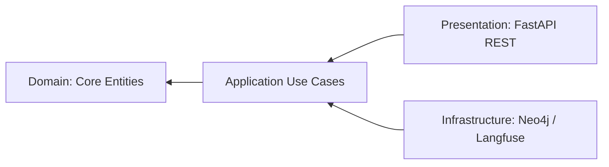
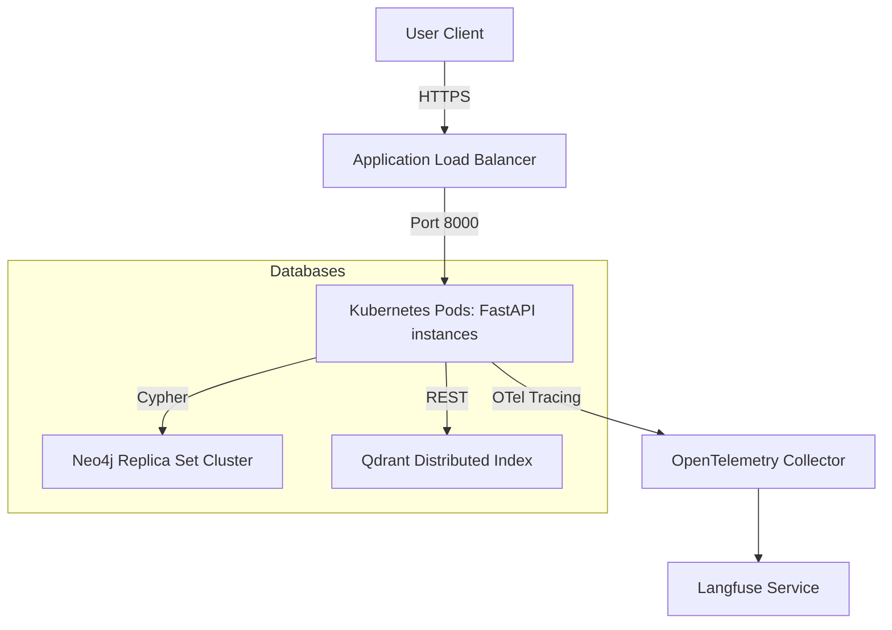

# EMIOS Ideal Production Architecture Blueprint

This document outlines the ideal enterprise-grade production architecture for the EMIOS platform. This architecture enforces clean division of concerns, strict dependency boundaries, resilient database mappings, and cloud-native observability.

---

## 1. Ideal Folder Structure (Clean Architecture)

We recommend transitioning the codebase into a Clean/Hexagonal directory layout to decouple business logic from framework and database implementations:

```text
EMIOS/
├── backend/
│   ├── app/
│   │   ├── domain/               # Inner Core: Pure Entity Rules (No dependencies)
│   │   │   ├── models/           # Domain schemas (Node, Edge, Wave)
│   │   │   └── exceptions/       # Core Domain exceptions
│   │   ├── application/          # Use Case Layer: Orchestrates Use Cases
│   │   │   ├── simulation/       # Simulation orchestrator services
│   │   │   ├── planning/         # LangGraph planning orchestrator
│   │   │   └── interfaces/       # Abstract Repository definitions (ABC)
│   │   ├── infrastructure/       # Outer Layer: External Providers
│   │   │   ├── database/         # Neo4j & In-Memory repository implementations
│   │   │   ├── tracing/          # Langfuse / telemetry tracers callbacks
│   │   │   └── logging/          # Structured JSON formatters
│   │   └── presentation/         # Interface Layer: Framework Specific
│   │       ├── api/              # FastAPI Routers & REST endpoints
│   │       └── middleware/       # Latency telemetry & Security CORS setups
│   ├── tests/
│   │   ├── unit/                 # Mock database use-case tests
│   │   ├── integration/          # FastAPI TestClient endpoint validations
│   │   └── e2e/                  # LangGraph multi-agent flow simulations
│   ├── Dockerfile
│   └── main.py                   # Bootstrapper (Registers DI and App)
├── frontend/                     # Modern Compiled React Application
│   ├── src/
│   │   ├── components/           # Reusable Graph/Dashboard UI widgets
│   │   ├── hooks/                # React state fetch triggers
│   │   ├── styles/               # Glassmorphic light theme configurations
│   │   └── main.jsx
│   ├── package.json              # Managed dependencies (npm)
│   └── vite.config.js            # Offline-capable local bundler
```

---

## 2. Layered Architecture & Dependency Rules

To prevent code pollution and circular dependency cycles, strict **Dependency Flow Rules** must be established:



* **Rule 1 (Inner Domain isolation)**: The `domain` layer must have zero dependencies on external libraries (FastAPI, Neo4j, LangGraph, Qdrant). It contains pure entities and calculation constants.
* **Rule 2 (Repository Pattern - Hexagonal)**: The `application` services communicate with databases solely via abstract Base Classes (interfaces defined in `application/interfaces/`). Concrete implementations (e.g., `Neo4jGraphRepository`, `InMemoryGraphRepository`) reside in the `infrastructure` layer and are injected at runtime via Dependency Injection.
* **Rule 3 (Dependency Inversion)**: High-level use cases do not depend on low-level utility modules. Both depend on domain abstractions.

---

## 3. Logging & Telemetry Architecture

### Structured Logging
* **Mechanism**: Shift from console formatting to **Structured JSON Logging** using standard libraries (e.g. `structlog`).
* **Format**: Logs are published as single-line JSON items containing:
  `{"timestamp": "...", "level": "INFO", "request_id": "...", "module": "simulation", "message": "Monte Carlo started", "elapsed_ms": 142}`
* **Integration**: Logs are parsed by log aggregators (ElasticSearch, Datadog) without complex regex extraction filters.

### Telemetry & Tracing (Langfuse)
* **Agent Trace Mapping**: Register standard LangGraph tracing callbacks:
  ```python
  from langfuse.callback import CallbackHandler
  langfuse_handler = CallbackHandler(
      public_key=settings.LANGFUSE_PUBLIC_KEY,
      secret_key=settings.LANGFUSE_SECRET_KEY,
      host=settings.LANGFUSE_HOST
  )
  # Pass handler directly to LangGraph run configuration:
  config = {"callbacks": [langfuse_handler]}
  ```
* **Metrics Tracked**: Prompt version IDs, token usage counts, execution latency, and agent reasoning traces.

---

## 4. Configuration & Exception Strategy

### Configuration Strategy
* Leverage `pydantic-settings` to manage configuration parameters dynamically.
* Environment variables must be typed, validated, and grouped:
  * `DatabaseSettings`: URLs, pools, timeouts.
  * `LLMSettings`: Model provider API keys (supporting either `OPENAI_API_KEY` or `GEMINI_API_KEY` for `gemini-1.5-flash`), temperatures, max loops.
  * `SecuritySettings`: CORS whitelist arrays, auth token keys.

### Exception Strategy
* Standardize on **RFC 7807 (Problem Details for HTTP APIs)** for error payloads:
  ```json
  {
    "type": "https://emios.io/errors/dependency-loop",
    "title": "Circular Dependency Found",
    "status": 400,
    "detail": "AuthService depends on UserDB which cycles back to AuthService.",
    "instance": "/api/plan",
    "error_code": "CIRCULAR_DEPENDENCY_DETECTED"
  }
  ```
* Exceptions inherit from a base `EMIOSException` and are translated to JSON by a global FastAPI middleware handler.

---

## 5. Deployment & Multi-Node Architecture

The production architecture recommends containerizing the layers to support high availability and automated scaling:



* **Stateless API pods**: FastAPI runs in stateless container pods, scaling horizontally based on CPU/Request queue loads.
* **Clustered Databases**: Neo4j runs in standard Core-Read Replica topologies to handle heavy topology graph traversal traffic without read latency bottlenecks.
