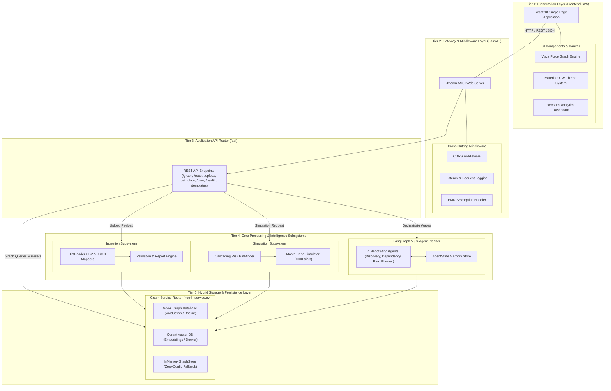
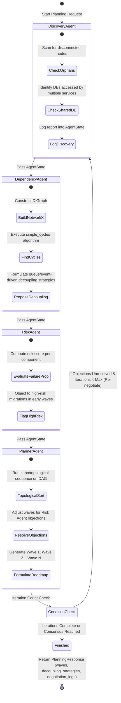
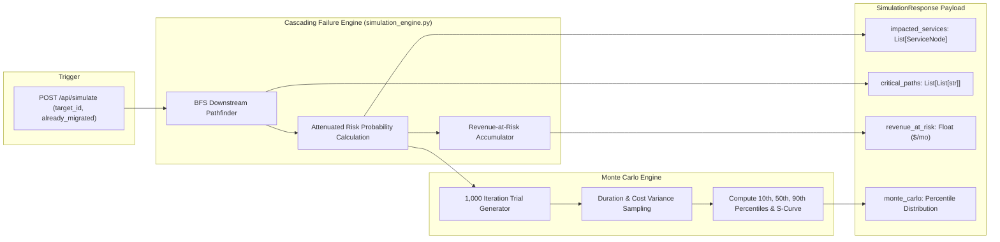

# System Architecture & Component Design - EMIOS

This document presents the complete system architecture for **EMIOS** (*Enterprise Migration Intelligence Operating System*). It details every layer, component, data flow, background service, database storage model, and fallback mechanism across the application.

---

## 1. High-Level Architecture Overview

EMIOS is structured into **5 clean architectural tiers**: Presentation, Gateway & Middleware, API Routes, Processing Subsystems, and Hybrid Storage.



---

## 2. End-to-End Ingestion Flow

The sequence diagram below details how raw CSV files or JSON metadata payloads are validated, parsed, and mapped into the Living Digital Twin database graph.

```mermaid
sequenceDiagram
    autonumber
    actor User
    participant Frontend as SPA Frontend (index.html)
    participant Endpoint as REST API (/api/upload)
    participant Resolver as Schema Resolver (resolve_key)
    participant Validator as Validation Engine
    participant GraphStore as Graph Service (neo4j_service.py)
    participant Database as Neo4j DB / InMemoryGraphStore

    User->>Frontend: Paste CSV/JSON or Upload Files
    Frontend->>Endpoint: POST /api/upload (FormData or JSON body)
    
    alt JSON Upload
        Endpoint->>Validator: Validate component_id, cost, and dependencies
    else CSV Upload
        Endpoint->>Resolver: Resolve flexible headers (System ID, App ID, Priority, Revenue, Cost)
        Endpoint->>Validator: Check required fields (id, name)
    end

    Validator->>Validator: Check for duplicate System IDs
    Validator->>Validator: Validate edge targets exist in node set
    Validator->>Validator: Detect self-referential loops (source == target)
    Validator-->>Endpoint: Return cleaned Node & Edge sets + Warnings/Errors list

    Endpoint->>GraphStore: reset_and_populate_graph(nodes, edges)
    
    alt Neo4j Driver Active
        GraphStore->>Database: MATCH (n) DETACH DELETE n; CREATE (s:Service); CREATE (a)-[:DEPENDS_ON]->(b)
    else Neo4j Unavailable / Zero-Config
        GraphStore->>Database: in_memory_db.clear(); populate nodes & edges
    end

    Endpoint-->>Frontend: UploadResponse (status, parsed_nodes, parsed_edges, skipped_count, warnings, errors)
    Frontend->>User: Display Ingestion Report Dialog & Render vis.js Graph
```

---

## 3. Multi-Agent Orchestration Loop (LangGraph Workflow)

When the user triggers **"Run Multi-Agent Planner"**, the execution flow transitions into a stateful multi-agent dialogue orchestrated by LangGraph.



---

## 4. Cascading Risk Simulation & Monte Carlo Architecture

The simulation engine combines graph propagation analysis with statistical modeling:



---

## 5. Granular Subsystem & Module Index

| Component Layer | File Path / Module | Key Functions / Classes | Responsibility & Purpose |
| :--- | :--- | :--- | :--- |
| **Server Gateway** | [main.py](file:///e:/POC_Projects/EMIOS/backend/main.py) | `FastAPI`, `log_latency_middleware`, `emios_exception_handler` | Application entry point, ASGI server initialization, static file serving, CORS setup, latency telemetry, and unified exception mapping. |
| **API Endpoints** | [endpoints.py](file:///e:/POC_Projects/EMIOS/backend/app/api/endpoints.py) | `fetch_graph`, `reset_graph`, `upload_metadata`, `download_templates`, `simulate_migration`, `plan_migration` | Exposes REST endpoints for digital twin retrieval, database resets, CSV/JSON metadata ingestion, sample template downloads, simulations, and agent workflows. |
| **Graph Database Service** | [neo4j_service.py](file:///e:/POC_Projects/EMIOS/backend/app/services/neo4j_service.py) | `InMemoryGraphStore`, `get_demo_dataset`, `reset_and_populate_graph`, `get_graph` | Hybrid database abstraction layer managing Neo4j connections and providing transparent in-memory fallback execution. |
| **Simulation Core** | [simulation_engine.py](file:///e:/POC_Projects/EMIOS/backend/app/services/simulation_engine.py) | `run_cascading_failure`, `run_monte_carlo` | Downstream risk pathfinder computing revenue-at-risk propagation and running 1,000 Monte Carlo distribution trials. |
| **LangGraph Workflow** | [workflow.py](file:///e:/POC_Projects/EMIOS/backend/app/agents/workflow.py) | `discovery_agent`, `dependency_agent`, `risk_agent`, `planner_agent`, `run_agent_negotiation` | Stateful multi-agent orchestrator executing negotiation rounds between 4 specialized AI agents. |
| **Agent State Model** | [state.py](file:///e:/POC_Projects/EMIOS/backend/app/agents/state.py) | `AgentState` | Typed dictionary state schema holding services, dependencies, negotiation logs, and wave roadmaps. |
| **Configuration Schema** | [config.py](file:///e:/POC_Projects/EMIOS/backend/app/core/config.py) | `Settings` | Pydantic configuration schema reading environment variables (`NEO4J_URI`, `OPENAI_API_KEY`, `GEMINI_API_KEY`, etc.). |
| **Database Connector** | [db.py](file:///e:/POC_Projects/EMIOS/backend/app/core/db.py) | `init_db`, `close_db`, `neo4j_driver` | Neo4j Python driver connection manager with error handling. |
| **Constants Registry** | [constants.py](file:///e:/POC_Projects/EMIOS/backend/app/core/constants.py) | Migration multipliers, thresholds | Centralized domain constants for risk attenuation factors, cost multipliers, and duration estimates. |
| **Exceptions Subsystem** | [exceptions.py](file:///e:/POC_Projects/EMIOS/backend/app/core/exceptions.py) | `EMIOSException`, subclasses | Structured domain exception hierarchy mapping custom exceptions to clean API error JSONs. |
| **Frontend Visualizer** | [index.html](file:///e:/POC_Projects/EMIOS/frontend/index.html) | `App`, vis.js Network, MUI theme, Recharts | Single Page Application presenting interactive force-directed graph twin, risk dashboards, agent conversation logs, and ingestion report dialogs. |
| **Demo Datasets** | [demo_nodes.csv](file:///e:/POC_Projects/EMIOS/backend/app/resources/demo_nodes.csv), [demo_edges.csv](file:///e:/POC_Projects/EMIOS/backend/app/resources/demo_edges.csv) | 56 nodes, 77 edges | Enterprise retail & banking architecture dataset for zero-config demonstration. |
